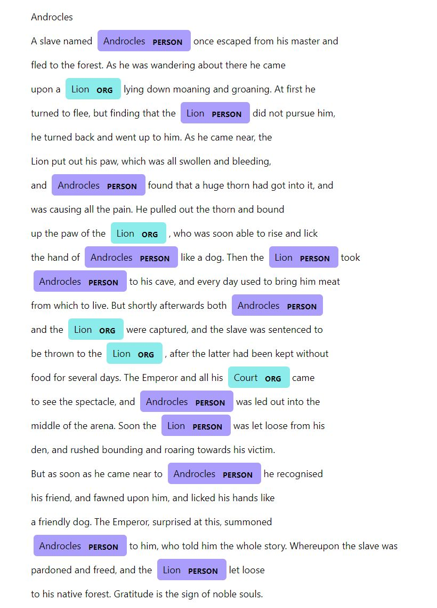

# Literacy situation models knowledge base creation

Literacy situation models knowledge base creation from english short fiction stories for Natural Language Processing class @ Faculty of Computer and Information Science, University of Ljubljana

## Prerequisites

Use the package manager [pip](https://pip.pypa.io/en/stable/) to install missing dependencies.

```bash
pip install -r requirements.txt
```

Navigate to code directory.
```
cd code
```
Install the Stanza model and nltk toolkit by running the following python script.

```bash
python download_models.py
```

Alternatively run these commands within a Python environment.

```python
stanza.download("en")
nltk.download('punkt')
```

Install the Spacy model by running this command from the command line.
```
python -m spacy download en_core_web_sm
```
## Repository structure
### Code

This folder contains all the necessary code to reproduce the results obtained in our report. The final 3 scripts under the horizontal line are "legacy code", while the first three reproduce results from the report. 
- **process_book.py** - contains code which builds a knowledge base from a given text. It contains NER, sentiment analysis and co-occurrence.
- **character_sentiment_analysis.py** - performs sentiment analysis on all corpora and saves the results in .json files
- **performance_analysis.py** - contains code used to run tests of different models and methods for character extraction and sentiment analysis
- **corpus_analysis.py** - contains code that performs simple corpus analysis (characters, words, sentences,
letters/word, words/sentence, sentences/story)
---
- **character_sentiment_aspect_experimental.py** contains code we used to perform Part-Of-Speech tagging and Dependency Parsing aspect based sentiment analysis, but without good results
- **named_entity_extraction.py** contains code used to read the _.txt_ books,  perform basic text preprocessing, character extraction, sentiment analysis and co-occurrence analysis. More or less a messy `process_book.py` with no command line arguments.
- **train_ner_spacy_litbank** folder contains the neccesary files to convert the annotated data from the LitBank corpus to Spacy format and train the NER classifier.


### Material

Contains three different corpora
  - **litbank_corpus** folder contains 100 medium fiction stories in .txt format from the LitBank corpus
  - **medium_stories_corpus** folder contains 7 medium fiction stories in .txt format
  - **short_stories_corpus** folder contains 82 short fiction stories in .txt format

### Results

- JSON files containing the results of our analysis


## Usage

### Building a knowledge base for a given text

To build a knowledge base for a single given text, execute the `processbook.py` script located in the `code` directory. 

The script performs named **entity extraction**, **character sentiment analysis** and **character co-occurrence extraction**. Fictional characters are extracted from short literature excerpts. A simple sentiment analysis on all characters follows, and finally the co-occurrence of recognized characters is studied.

Its arguments are:
- *corpus* (default: `litbank`) - specifies the corpus name
- *file* (default: `76_adventures_of_huckleberry_finn_brat.txt`) - specifies which text file from the given corpus will be analyzed. Note that files that contain spaces must be in quotation marks (e.g. "`Belling the Cat.txt`").
- *visualize* (default: `n`) - setting this to `y` will automatically open the co-occurrence network and NER visualization. If not set these can still be manually opened.

Two example runs:

```bash
py process_book.py --corpus=short --file=Androcles.txt --visualize=y
py process_book.py --corpus=litbank --file=76_adventures_of_huckleberry_finn_brat.txt
```

Co-occurrence network visualization is saved in `cooccurrence-network.html`.

NER visualization is saved in `cooccurrence-network.html`.

An example output looks like this:
```
=========== Detecting entities with Stanza... ===========

['androcles', 'lion']

=========== Performing sentiment analysis... ===========

{'stats': {'sentiments': [0, 0, -1, 0, -1, 0, 0, -1, 0, -1, 1, 0, -1, 0], 'avg_sentiment': -0.2857142857142857, 'num_sentences': 14}, 'androcles': {'sentiments': [0, 0, -1, 0, 0,
-1, 0, 1, 0], 'avg_sentiment': 0.1746031746031746}, 'lion': {'sentiments': [-1, 0, -1, 0, 0, -1, -1, -1, -1], 'avg_sentiment': -0.38095238095238093}}

=========== Resolving cooccurence... ===========

[['androcles', 'lion', 0.1746031746031746, -0.38095238095238093, 2]]
You can view the visual representation of character co-occurence by viewing the cooccurrence-network.html file.


=========== Visualizing NER with Spacy... ===========

You can view the visual representation of named entity recognition by viewing the ner-visualization.html
```

Example NER visualization and co-occurrence graph.

"Good" characters are marked as green nodes, "bad" characters are marked as red nodes. Stronger co-occurence between entities is denoted by thicker node connections.




### Performance testing
For generating performance results, that are located in folder results, run the code:


`python performance_analysis.py generate`


For comparing different performance results between spacy and stanza, as seen in report table 1, run the performance_analysis.py with the argument being the corpus you want to analyze. For example for comparing performance of spacy and stanza on litbank corpus run:


`python performance_analysis.py litbank`

For generating sentiment results, that are located in folder results, run the code:


`python character_sentiment_analysis.py`

## Report

- [PDF](./report.pdf) version of our report 

## Contributing

Pull requests are welcome. For major changes, please open an issue first to discuss what you would like to change.

## Copyright

Nino Brezac, Klemen Klemar, Jan Krivec ©
